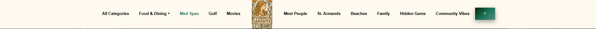
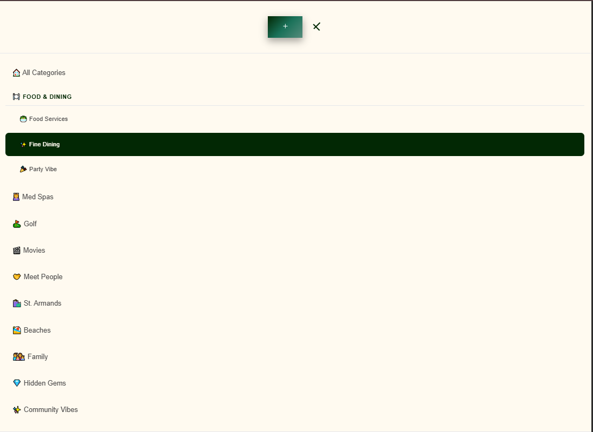
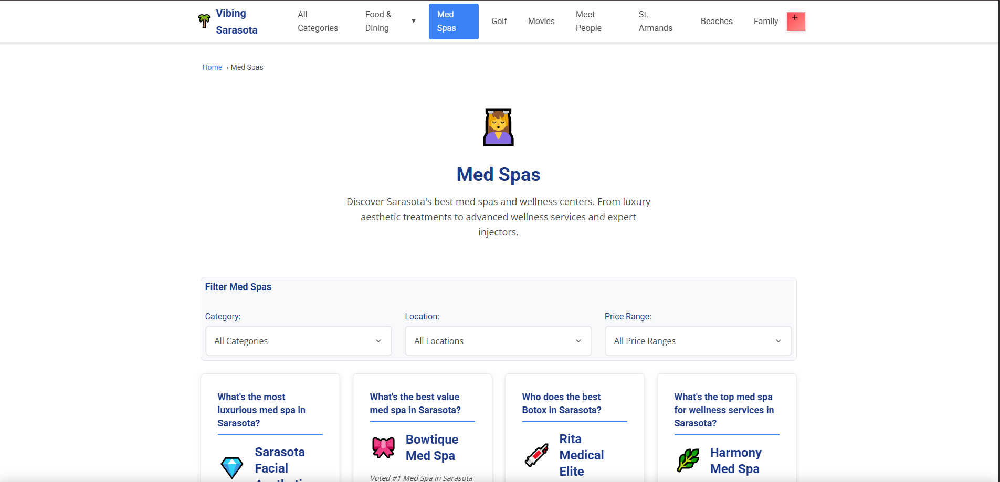
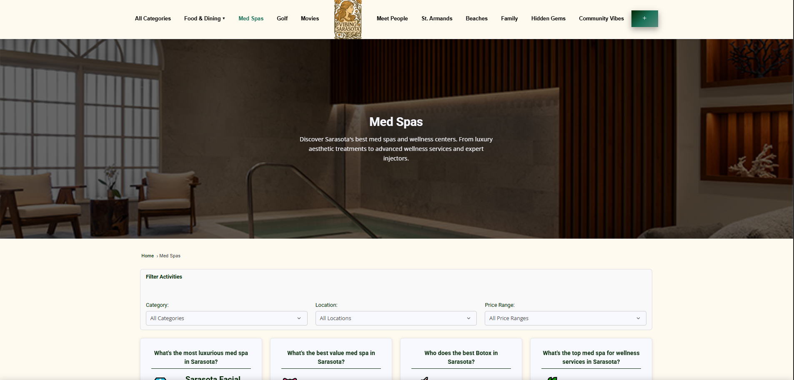
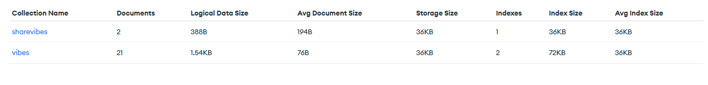
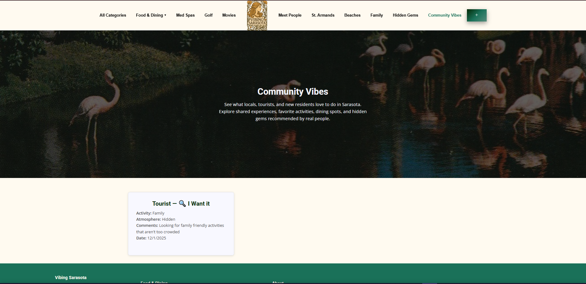

# Refactoring Vibing Sarasota 

### Paige Grimes 

---

## Refactoring

My first step in refactoring was to reduce the html bloat. To do this, I first created the ejs files that would define each component.
I then created routes for the express server that would return the web pages with different features such as the 
titles and meta tags. By separating the code into components, I was able to define the head, navigation, vibe modal, and footer only
once. They each then only take up one line of html in the html files that define the body of each webpage. This is useful
in situations where the html needs to be modified. It removes the headache of having to modify multiple different files throughout the project.

After refactoring to Express.js and ejs, I worked on the front end. I first fixed the previous issue I was having
with the responsive navigation. It wasn't until after the issue was fixed that I decided to change the layout and color 
scheme of the website. 

The image located in the center of the navigation was created by ChatGPT with the prompt "Create an image in an Art Nouveau 
style: flowing lines, organic shapes, floral motifs, and soft, decorative elegance. Logo for a website called: Vibing Sarasota".
I then took the image and made it a transparent png. Ideally in actual production it would be nice to have a local artist
design the logo since Sarasota is art centric. I wasn't sure how to incorporate it into the mobile navigation without it 
taking up too much space.

__Previous Navigation__


__New Navigation__




In the beginning I wanted to add images to the top of each business card but this seemed overtly time-consuming without 
the help of web scraping. So instead, I had an idea to change the background of each page header to an image representing 
one of the locations in each category. 

__The previous Med Spa page__ 



__The NEW Med Spa page__



__Here is how the business cards used to look__


__Here is how they look now__


Once I was happy with the CSS, I worked on implementing the Database with MongoDB Cloud. I created a collection called vibes, which keeps track of 
vibe count for each business, and then I created a collection called vibe share that saves the users recommended 
vibes through the vibe modal. The schemas for the collections are located in the _./models_ folder and the routing information
is located in _vibes.js_. 




The function that make calls to the routes is located in _./public/js/shared.js_. I modified submitVote(businessId) 
so that it made a call to the backend to POST the updated vote count rather than the api call defined previously. fetchVibeScore(businessId)
was then modified to GET the vote count for each location so that it can be displayed on the business cards.

For the vibe modal I added, in _./public/js/vibe-widget2.js_, the async function submitForm() to POST the users form options.
To GET the users submissions I simply created a route in _./routes/vibes.js_ that fetched the data from the Database then 
rendered the ejs page _vibe-shares.ejs_ in a similar way to the routes for the other pages.

You can find other users submissions on the __Community Vibe__ page:




## Reflection

---

For the frontend, I utilized the lectures on flexbox to restyle the navigation and the vibe widget. The lectures helped 
me tremendously in understanding how to position different elements. A stronger understanding also assisted me in modifying
other attributes such as the vibe index buttons. For the backend, the lectures on javascript and routing helped me with
rewriting the code for the vibe widget, modifying/creating form submission functions, and creating the routes for each
webpage. For the web strategy portion of the project I added accessibility. Since all the images 
throughout the website are mostly background images and don't possess alt tags, I added an aria-label to each header 
therefore providing a short description of each image. Learning more regarding SEO tags or how to monitor performance metrics
would have been nice, but all-in-all I believe I learned a great deal this semester and am much more confident in web
programming than I was before. 

## Running the program

After cloning the Repository, open the terminal and run: 
```cmd
npm install
```

Create an .env file in the root directory of the project and add the following environment variables:
```dotenv
MONGO_URI=<mongoServerPath>
LOCAL_URI=http://localhost:3000
```

Then, run the project locally:

```cmd
> cd bin
> node www
```

Or, open the file and run the current file. 

Finally, open the browser of your choice and visit http://localhost:3000

